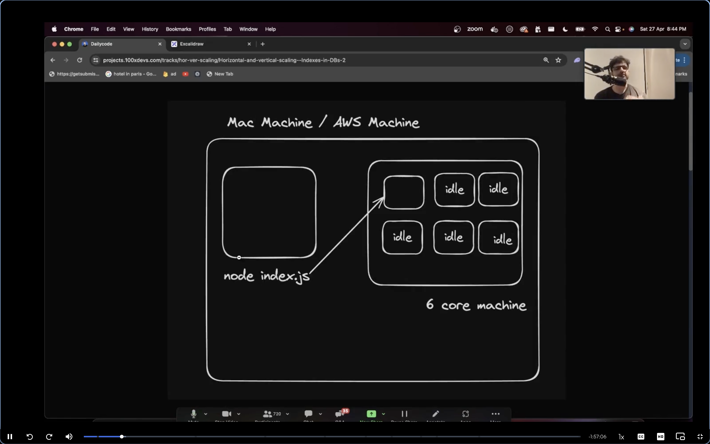
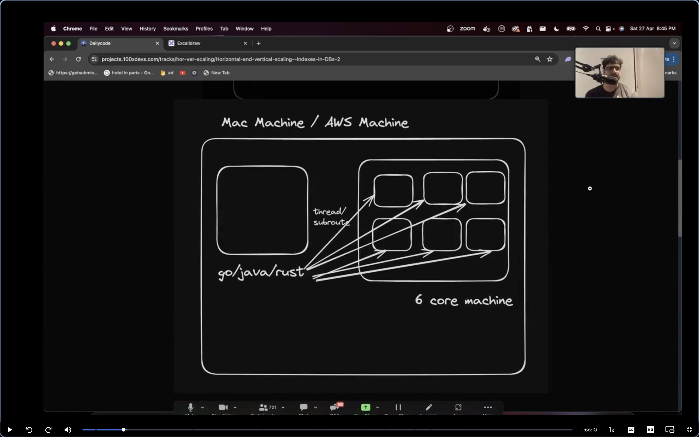

# Horizontal and Vertical Scaling in DataBase:-

Q. What we will be discussing ?
Ans. Server -> Cluster module and horizontal scaling, Capacity estimation , auto scaling group (ASG) and vertical scaling, Load blanacer
    DataBase -> Indexing, Normalization and Sharding.

The one thing which you need to remember is that node js will never be able to take the advantage of the CPU of the AWS take how many cpu's you want but the process will still run on the single CPU irrespective of how big is your machine.

Remember the more load on the application the bigger you need the storage from the AWS instance.
Remember javascript is the single threaded language.It can only utilise only one of the CPU 

Q. so the main question is that is it good to do vertical scaling in your nodejs process?
Ans. Vertical scaling means increasing the size of your machine to support more load.(increasing the size means increasing the memory, means increasing the number of CPU for your project.)

nodejs is not the best for the vertical scaling 

Now what about multi threaded language ->

languages that let you use all the cores of the rented machine languages like rust, java, golang.

D
59563  node         99.5  00:33.06 7/1    0    30    12M    0B     11M    59563 59217
57093  node         99.1  14:37.56 7/1    0    19    12M    0B     10M    57093 56269
59214  node         99.0  00:43.54 7/1    0    30    12M    0B     10M    59214 58863
59911  node         98.8  00:28.86 7/1    0    30    13M    0B     11M    59911 595

we ran the simple infinite for loop and here you can see the CPU usage by the for loop
the for loop is 
let c = 0;
while(1){
    c++;
}
it is running in the 4 ports so you can see the partition of the ports like nodejs is single threaded language but if you run nodejs on the different ports the tasks then got partition and turn into the multi threadeed process.
Q. Can you use nodejs instead of go and rust and java 
Ans. Yes, but the reason is that ->
1. But this process is very ugly.
2. It is very hard to share data with each other

Q. What if you use the language like rust golang or java do you still need to use the three terminals ?
Ans. use std::thread;
fn main(){
    //Spawn three threads
    for _ in 0..3 {
        thread::spawn(||{
            let mut counter = 0.64;
            loop {
                counter += 0.001;
            }
        });
    }
    loop {
        //Main thread does nothing just keep the project alive just like the while loop running infintely in the nodejs process.
    }
}
this is the rust program 
Result of this code ->
4 threads running infinite loops → 100% CPU usage on multiple cores.
 PPID
64462  week-22      390.1 00:21.59 4/4    0    14    993K   0B     608K   64462 
here you can see that the process is using 390.1 CPU which means 4v cpu meand 4 cores of your CPU.

In the end vertical scaling means that increasing the RAM or the size of the CPU to scale the application.

Q. If js is single threaded language how does it perform asyc.
Ans. Achieves asynchronous behavior through a combination of the Event Loop, Callback Queue, and Web APIs (in browsers) or Node.js APIs (in Node.js environments).

the issues with the implementaiton of the vertical scaling is that ->
1. Just ugly to do this, keep track of the processes up and down.
2. Processes will have port conflicts you will have to run each process on a seprate port.

const express = require("express");
const cluster = require("cluster");
const os = require("os");

const totalCPUs = os.cpus().length;

const port = 3000;

if (cluster.isPrimary) {
  console.log(`Number of CPUs is ${totalCPUs}`);
  console.log(`Primary ${process.pid} is running`);

  // Fork workers.
  for (let i = 0; i < totalCPUs; i++) {
    cluster.fork();
  }

  cluster.on("exit", (worker, code, signal) => {
    console.log(`worker ${worker.process.pid} died`);
    console.log("Let's fork another worker!");
    cluster.fork();
  });
} else {
  const app = express();
  console.log(`Worker ${process.pid} started`);

  app.get("/", (req, res) => {
    res.send("Hello World!");
  });

  app.get("/api/:n", function (req, res) {
    let n = parseInt(req.params.n);
    let count = 0;

    if (n > 5000000000) n = 5000000000;

    for (let i = 0; i <= n; i++) {
      count += i;
    }

    res.send(`Final count is ${count} ${process.pid}`);
  });

  app.listen(port, () => {
    console.log(`App listening on port ${port}`);
  });
}

this code is getting all our CPU cores tog et to work
like totalCPus = os.cpus().length; is using all the cpus cores of our machine.

node index.js
Number of cluster is: 8 this is the number of the cores my pc have.
Primary 73538
Worker 73539 started 
App listenting on 3000
Worker 73541 started
App listenting on 3000
Worker 73543 started
Worker 73540 started
Worker 73544 started
App listenting on 3000
App listenting on 3000
Worker 73545 started
Worker 73546 started
App listenting on 3000
App listenting on 3000
App listenting on 3000
Worker 73542 started
App listenting on 3000

the main thing is that ki sare process chal rhe hai kyunki koi bhi port conflict didn't happen. 
This makes out process more fast and node is more mutli core and faster.